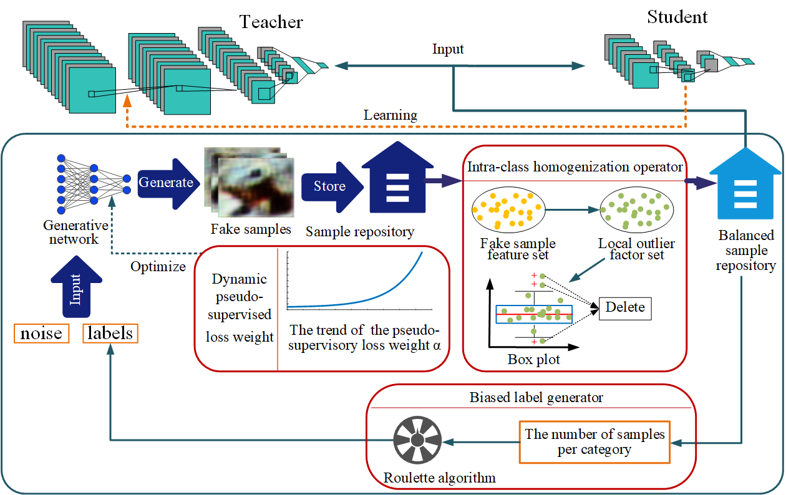
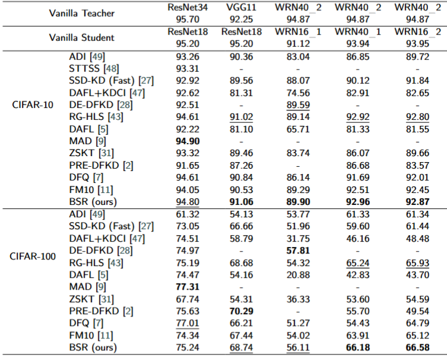

# BSR: data-free knowledge distillation with balanced sample repository
---
**This is the pytorch implementation of paper "BSR: data-free knowledge distillation with balanced sample repository"(updating).**
Owing to strict requirements regarding actual data security and privacy, data-free Knowledge distillation (DFKD) typically employs a generative network to produce fake samples for training student models. However, we discover that the datasets consisting of these fake samples utilized for training students are frequently imbalanced. These imbalances are evident in unclear class margins, uneven intra-class distribution, and skewed label distribution, ultimately impeding the performance of DFKD. To overcome the weakness, this paper proposed DFKD with a balanced sample repository (BSR). Specifically, BSR comprises three integral components: dynamic pseudo-supervised loss weight (DLW), biased label generator (BLG), and intra-class homogeneity operator (IHO). The fake samples generated by the generative network are initially stored in the sample repository, and those three components achieve a balanced dataset by influencing this sample repository. DLW dynamically adjusts the pseudo-supervised loss weight to avoid overcrowding other losses, ensuring that the sample repository maintains distinct class margins. BLG employs the roulette algorithm to generate as many samples as possible for classes with fewer samples, thereby balancing the label distributions. Moreover, IHO utilizes the fake samples' local outlier factors to remove crowded or outlier samples to homogenizing the distribution of samples within each category. The experiments conducted on CIFAR-10, CIFAR-100, ImageNette2, and ImageNet100 demonstrate that the proposed method achieves competitive results and produces more balanced samples.
The proposed method is called BSR. It's pipeline as shown is follows.


# Requirements
- torch
- torchvision
- matplotlib
- numpy
- scikit-learn
- einops
- termcolor
- kornia
- pillow
- tqdm


# Getting Started
1. Training the TEACHER model
   ```bash
   python train_scratch.py --model resnet34 --dataset cifar10 --batch-size 64 --lr 0.1 --data_root your/dataset/path/
   ```
   
   You can also use the pre-trained teacher model provided by [CMI](https://www.dropbox.com/sh/w8xehuk7debnka3/AABhoazFReE_5mMeyvb4iUWoa?dl=0)  directly. Place these models in 'checkpoints/pretrained/'.
2. Performing BSR
   ```bash
   python -u bsr_main.py --warmup 20 --epochs 420 --batch_size 256 --dataset cifar10 --method bsr --teacher resnet34 --student resnet18 
   ```
# Replicating our results

You can execute the code in scripts/bsr.sh to reproduce the results of this article. Note that you must change the *data_root* parameter in order for the program to recognize the dataset.

# Visualization

You can use the **show_result** folder to visualise the images in your paper. Visualisations of ablation experiments and hyperparameters are provided here.
1. For the ablation experiment, you need to follow the instructions in the previous section to get a trained student, then running:
```bash
python show_points_ablation.py
```
- Of course, you have to modify the model architecture, dataset and other parameters in **show_points_ablation.py**.
- This python program will use the trained student model to obtain low dimensional features of the image, which are stored in a CSV file. Please manually move these files into show_result/ablation_points/. We have uploaded the feature files to this repository and you can also use our results directly.
**Finally, you need to run the ablation.m file using Matlab to get the TSNE visualisation figure.**
2. For the visualisation of hyperparameters, we have integrated the results for different parameter values into the file show_result/hyperparameters/hp.m, which you can run directly with Matlab to get the figures.
  
# Dataset link
- CIFAR https://www.cs.toronto.edu/~kriz/cifar.html
- SVHN http://ufldl.stanford.edu/housenumbers/
- ImageNet100 and ImageNette2 https://image-net.org/
  
# Experiments
### Comparison with SOTA DFKDs on CIFAR-10




# State
**Our code is based on [Fast-meta](https://github.com/zju-vipa/Fast-Datafree) and [CMI](https://github.com/zju-vipa/CMI). We are sincerely grateful for the above work!**
